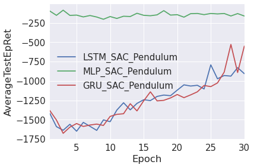
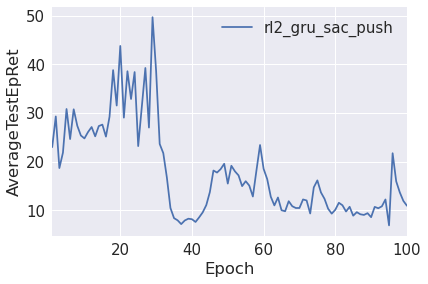

# rnn-sac
A lot of popular implementations of the Soft-Actor Critic (SAC) lack the implementation of Recurrent Neural networks (RNN), however using RNN is one of the approaches to tackle meta-learning. Hence, this repository is meant to test the meta-learning capabilities of RNN policies combined with SAC on the meta-world environements. Keep in mind the current implementation is experimental and might contain mistakes. 

## Install requirements
The `commands/install_script.sh` contains the instructions to create the conda-environment and install the right versions of the libraries.

## Implementation
To compare with an existing meta-learning library, that does implement Meta-Reinforcement Learning agents, several experiments have been run using [Garage](https://github.com/rlworkgroup/garage). The results of these runs can be found in `rnn-sac/data` and on tensorboard, https://tensorboard.dev/experiment/w8c0BIYiRE2wV5Vu4jn9lA/. 

Prior to RNN SAC, the precurser of SAC, DOG and DDPG have been attempted to be combined with RNNs. These results are found in memory-based control with RNNs. However, to the best of my knowledge SAC has not been explored yet. The used implementation is based on that of [SpinningUp](https://spinningup.openai.com/en/latest/spinningup/spinningup.html) by OpenAI. Where the experience replay buffer now relies on storing entire episodes and all the networks contain RNN cells. For meta-learning, a RL2/Learning to Reinforcement learn approach is applied where each episode a new task is sampled from a task distribution, a Markov Decision Process, which the agent has to maximize the future cumulative reward over. The task distribution is based on that of Meta-World. 

Currently, the agent is able to solve the Pendulum task, however still observes poor performance on more advanced tasks (the Meta-World ML1 tasks). The usage of the GRU cells, over the LSTM already gives us a slight increase in performance.

## Results (WIP)
These are the initial results, I havent applied any parameter tuning which could improve these results further, Additionally, we observe the RL2 results becoming really unstable and diverge after 30 epochs or so, this could be improved by properly evaluating alpha annualing. 

### TODO:
However, there are several other ideas which have yet to be attempted, 

- [X] Implement LSTM and GRU RNN cells
- [ ] Parameter tuning of the SAC experiments
- [ ] Evaluate on the agent on gridworld, which requires a discrete policy
- [ ] Compare the SpinningUp implementation with other better performing implementations, such as the [original implementation](https://github.com/haarnoja/sac) or the [soft-learning library](https://github.com/rail-berkeley/softlearning)
- [ ] Attempt different experience replay methods such as Hindsight Experience Replay or Prioritized Experience replay

**References**
- [RL2: Fast Reinforcement Learning via Slow Reinforcement Learning](https://arxiv.org/abs/1611.02779)
- [Learning to Reinforcement Learn](https://arxiv.org/abs/1611.05763)
- [Memory-based control with recurrent neural networks](https://arxiv.org/abs/1512.04455)
- [Revisiting Fundamentals of Experience Replay](https://arxiv.org/abs/2007.06700)
- [Hindsight Experience Replay](https://arxiv.org/abs/1707.01495)
- [Soft Actor-Critic Algorithms and Applications](https://arxiv.org/abs/1812.05905)
- [Meta-World: A Benchmark and Evaluation for Multi-Task and Meta Reinforcement Learning](https://arxiv.org/abs/1910.10897)